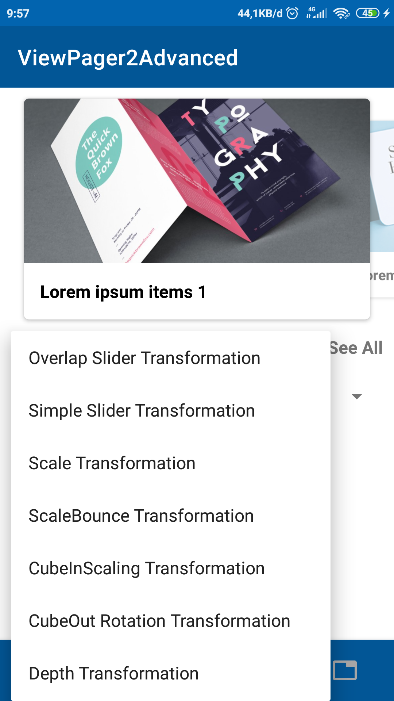
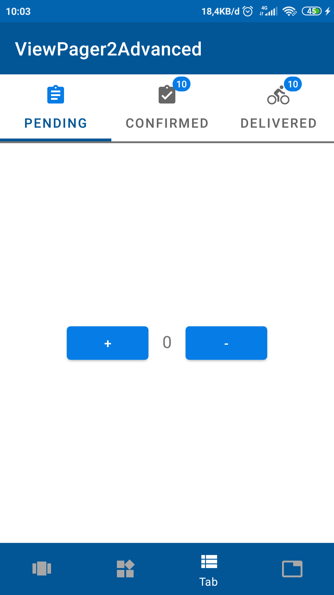
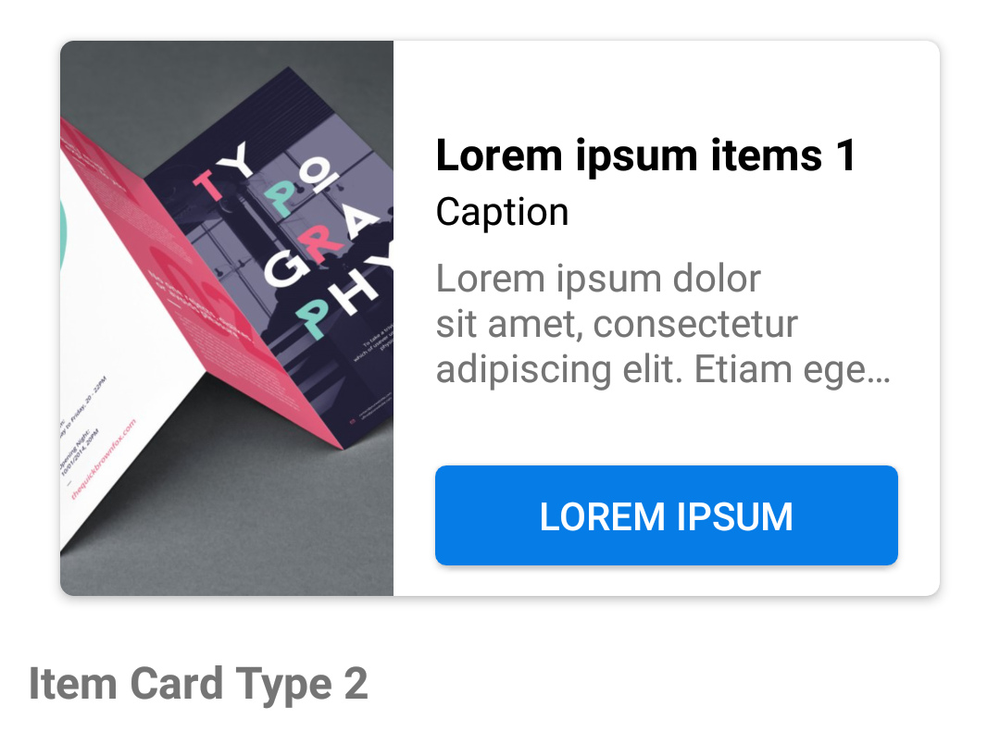

## Viewpager2 Advanced

Multiple view with viewpager2

## Features
- Android Kotlin
- Custom Carousel Banner
- Multiple view type
- Viewpager2 with tab and badge
- Dynamic tab fragment

## Screenshots

    
    
    
    

Item View Type

    
    
    
    
    

